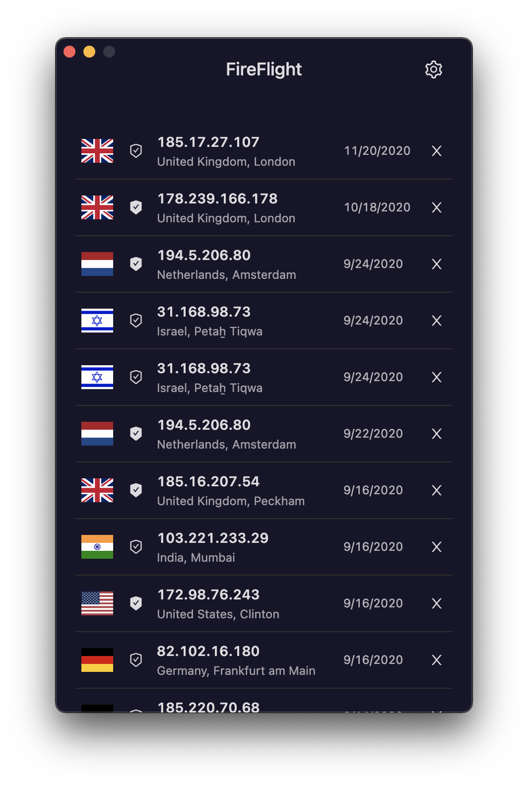
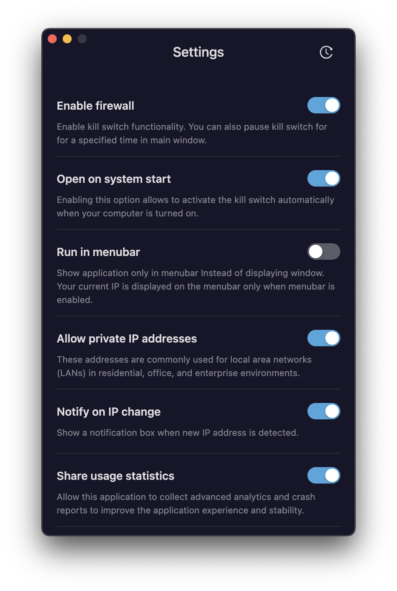
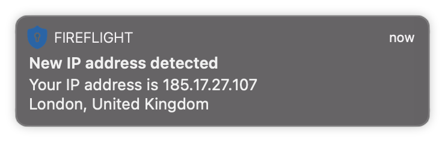

# Don't worry about your internet connection!

Fireflight is an exclusively free open-source macOS application that allows you to limit your incoming and outgoing traffic to a specific IP to restrict unauthorized connections and eventually works as a kill switch.

 

  
   

Fireflight will prevent users from reaching sensitive services without an authorized network connection and will notify users of network and IP change.

 

     

### Still works in the progress

This package is under the development stage, and it may not work suitably on your devices. Feel free to start a pull request to contribute to this project at any time.

### TBD

- Add support of Windows
- Write test cases
- Refactor IPC structures
- Update electron
- Compleate Readme and documents
- Add dynamic version control
